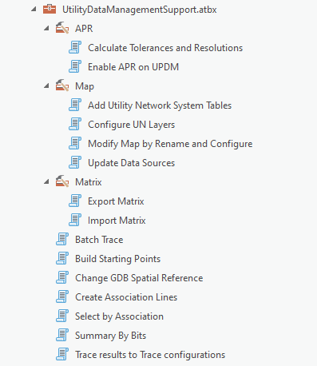
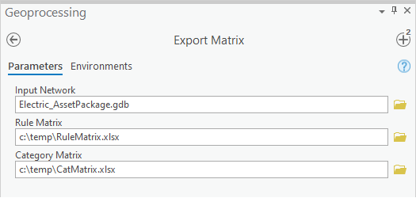
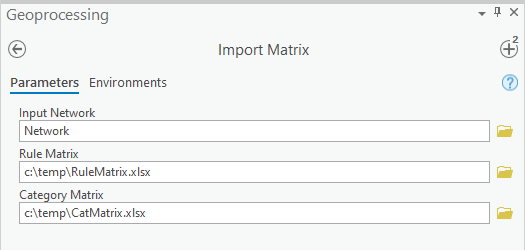
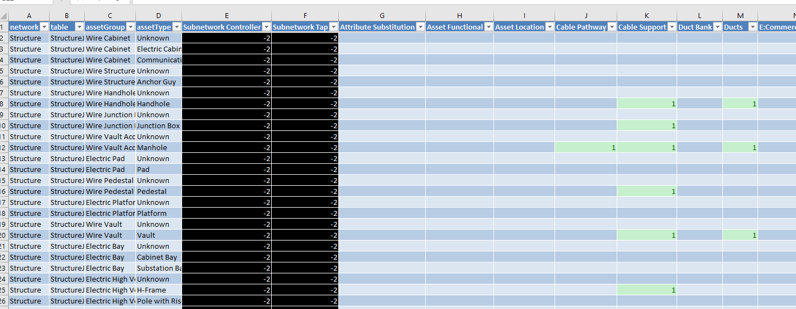
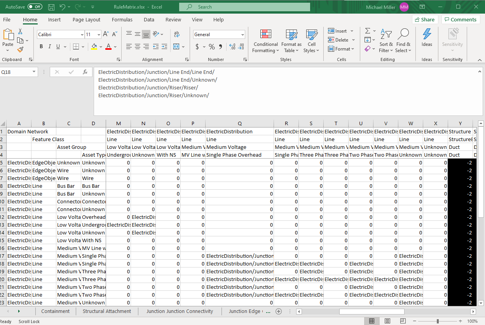

**Import/Export Matrix's**

**Overview**

The Import Matrix and Export Matrix tools allow you to view and set the rules and categories of a utility network or asset package in Excel. 

The utility network rules are used to control how assets can be connected, contained or attached to other assets. Those rules have to be explicitly set to permit the desired behavior. A fully configured utility network data model, such the data models provided by Esri, can contain thousands of rules. ArcGIS Pro includes tools to view, add, and remove individual rules, but visualizing the entire rule set and quickly understanding how assets are permitted to connect is difficult.

A network category is a tag used to represent a characteristic of an asset in your network. They are created and assigned to network features for specific asset group and asset type combinations. The matrix simplifies the process of assigning categories and present a simple view to see current assignments.

- **Export Matrix** This tool requires an asset package or utility network as an input and outputs an Excel xlsx workbook for the rules and/or categories. 
  - 
- **Import Matrix:** This tool imports the rules and/or categories workbook into an utility network or asset package. 
  - 
  
**Categories Matrix workbook**
The Categories workbook allows you assign and view the current category assignments.  It also allows you to create new categories and assign them to asset types.  The workbook includes one worksheet where the first four columns represent the Domain Network, Class, Asset Group and Asset Type. The headers of remaining columns represent the categories name.

The values of the intersection of these headers can have 3 different values.

- 0: Category Not Assigned
- 1: Category Assigned
- -2: Not Valid

Using the workbook is easy:
- To assign a category, simplify fill out the cell with the value of 1. 
- To remove a category, change the entry to a 0. 
- To define a new category, add a new column and then make the assignments. 
- Once complete, run the **Import Matrix** tool to import the assignments into your utility network or asset package.

**Rule Matrix workbook**
This workbook allows you to define and view the rules for a utility network. The workbook includes 5 worksheets, one for each type of rule. Each worksheet utilizes a series of header cells to display the Domain Network, Feature Class, Asset Group, Asset Type and Terminal (if the rule supports it).

The values of the intersection of these headers can have 3 different values on Containment, Structural Attachment, Junction Junction Connectivity, and the Junction Edge Connectivity workbook.

- 0: No Rule Defined
- 1: Rule Defined
- -2: Not Valid

The Edge Junction Edge workbook is slightly different as this rule requires 3 pairs of AssetGroup and AssetTypes, so the Left and Top column headers are the Edges and the values in the cell are the Junctions allowed by the Edge Junction Edge rules. Entries of 0 and -2 are the same, but to define the rules, a list in the format of Domain/Class Type/AssetGroup/AssetType/Terminal is added. The Class Type is not the actual class name in the GDB, but the type of class, so it would be either Device or Junction. Terminal is optional.

- ElectricDistribution/Junction/Line End/Line End/
 ElectricDistribution/Junction/Line End/Unknown/
 ElectricDistribution/Junction/Riser/Riser/
 ElectricDistribution/Junction/Riser/Unknown/

Using the workbook is easy:
- To add a rule, simplify fill out the cell, either by changing it to a 1 or in the case of Edge Junction Edge, adding the entry as specified above. 
- To remove a rule, change the entry to a 0.
- Once complete, run the **Import Matrix** tool to import the rules into your utility network. 
  - **Note:** If you have removed a rule from the rules matrix, you will need to delete that rule or all rules from the utility network or asset package and then Import Matrix.
